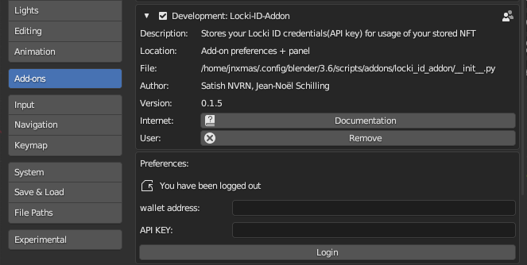

# MultiversX Blender Addon

Connect Blender to the MultiversX ecosystem, bridging the gap between 3D creation, generative design, and blockchain technology. 

## ✨ You mint, lucky you! ✨

## Introduction

The MultiversX Blender Addon establishes a symbiotic link between Blender and the MultiversX ecosystem. This facilitates 3D artists, designers, and developers in the realization of 3D creation and generative design. Using this addon, users can manage the 3D data stored in their MultiversX devnet (for the moment) wallets and harness Blender's capabilities to construct, modify, and visualize 3D assets. From primitive CAD constructions to intricate meshes, and even the underlying Python code, everything is (will be) made accessible and manageable.

One of the prominent features is the integration with Blender's powerful Geometry Nodes, leveraging their capabilities to accelerate and enhance 3D creation processes.

By integrating with `locki.io`, this addon promotes a revolutionary sharing system, allowing unparalleled synergy between designers and those commissioning designs.

> **Note**: The product is currently in its alpha phase, crafted specifically for the MultiversX-Encode Hackathon. Your insights and feedback will be instrumental in shaping its trajectory!

## Requirements

- **Blender**: Ensure you're running a compatible version of Blender. [Download the latest version here](https://www.blender.org/download/).
- **MultiversX Devnet Wallet**: Before using this addon, you must possess a wallet on the MultiversX devnet.
- **API Key from app.locki.io**: **soon** ~~Connect your MultiversX devnet wallet to [app.locki.io](https://app.locki.io) and obtain a connection API key. This key allows the addon to communicate and manage 3D data from your wallet.~~

## Installation

1. Download the latest release of the MultiversX Blender Addon.
2. Open Blender and navigate to `Edit > Preferences > Add-ons`.
3. Click on `Install` and select the downloaded addon file.
4. Activate the addon by ticking the checkbox.
5. In the addon preferences, enter your API key from app.locki.io.

## Usage

1. **Configuration**: After installing the addon, go to Blender preferences and locate the MultiversX addon settings. Here, enter your wallet address and the associated API key.  

Once you are connected, you can use the content of the panel in the 3D viewport of you blender.
2. **Accessing the Panel**: In the main Blender UI, open the side panel (typically toggled with the `N` key). You should find the MultiversX panel available. From this panel, you can explore various creations and connect to the blockchain.
  
3. **Trying CAD Creations**: If you're keen on experimenting with CAD creation features, please send us a request on the [Encode Discord](https://discord.gg/encodeclub). We'd be thrilled to facilitate a minting process for your designs.

## 3D NFT (Non-fungible Token) Definitions

- **NFT**: Traditionally encapsulates a PNG preview, supplemented by a GIF or MP4 for a richer experience.

In the realm of this addon, we introduce innovative NFT categories:
  
- **Standard 3D NFT**: Elevates the conventional NFT by embedding `.gltf` objects, enhancing web displays.

- **DataNFT**: Built on the Itheum platform, this NFT offers a preview thumbnail, a detailed preview, and a concealed mesh part (formats like `.step`, `.gbl`...). The concealed assets are exclusively accessible to the NFT owner.
  
- **Evolutive Coded DataNFT**: Another Itheum-backed NFT, this variant is dynamic in nature. It consists of a preview thumbnail, an intricate preview, concealed Python code (`.bpy`), and a `.json` file with adaptable links. These links can be periodically updated by the creator, ensuring compatibility with software evolution. Here too, concealed assets are a privilege of the NFT owner.

- **Configurable DataNFT**: Rooted in Itheum's capabilities, this NFT is parametric. It showcases a preview thumbnail, a detailed preview, and a concealed parametric mesh (`.gltf`). This allows the owner to tweak certain parameters, customizing the mesh as per their desires.

Enjoy!

## Status & Contribution

This project is currently in its **alpha** phase and is primarily a proof of concept for the MultiversX-Encode Hackathon. We're investing significant efforts to ensure its stability, extend its features, and enhance usability.

Feedback, bug reports, and contributions are highly appreciated. Feel free to open issues or submit pull requests.

Happy Designing with MultiversX Blender Addon!

## Inspiration / Credits

Thanks to CGPython, Erindale and Khamurai for their inspiration towards blender and geometry nodes

---

Embark on a transformative design journey with MultiversX Blender Addon!

# Inspirations from creators 

Thanks for the inspiration from 
- [CGpython](https://github.com/VictorStepanov): for having a structured approach of the python capabilities of Blender and its combination of use with geometry nodes.  
- [Erindale](https://github.com/Erindale) : From the usage from svershok addon to the eduction on blender geometry nodes  
- [Khamurai](https://www.patreon.com/khamurai) for his tentacles inspiring video to use geometry nodes to its full potential.  

They brought Geometry nodes to our knowledge and passion! 

## GNU General Public License version 3 (GPLv3)

The GNU General Public License version 3 (GPLv3) is a free software license that ensures the freedom for users to run, study, share, and modify the software licensed under it. Here are its key provisions:

- **Freedom to Use**: Users can run the software for any purpose.
- **Freedom to Study and Modify**: Users have access to the source code and can modify it.
- **Freedom to Share**: Users can redistribute the software and their modifications.
- **Copyleft**: If users distribute modified versions of the software, they must also license their changes under the GPLv3. This principle ensures that derivative works remain free.
- **Protection Against Software Patent Claims**: The license provides safeguards against potential patent litigation.
- **Compatibility**: It addresses compatibility concerns with other licenses.
- **Tivoization**: GPLv3 contains measures against "tivoization", where hardware restrictions might prevent users from running modified versions of the software on their devices.

The license's intention is to guarantee users the freedom to share and change all versions of a program, ensuring it remains free software for all its users.