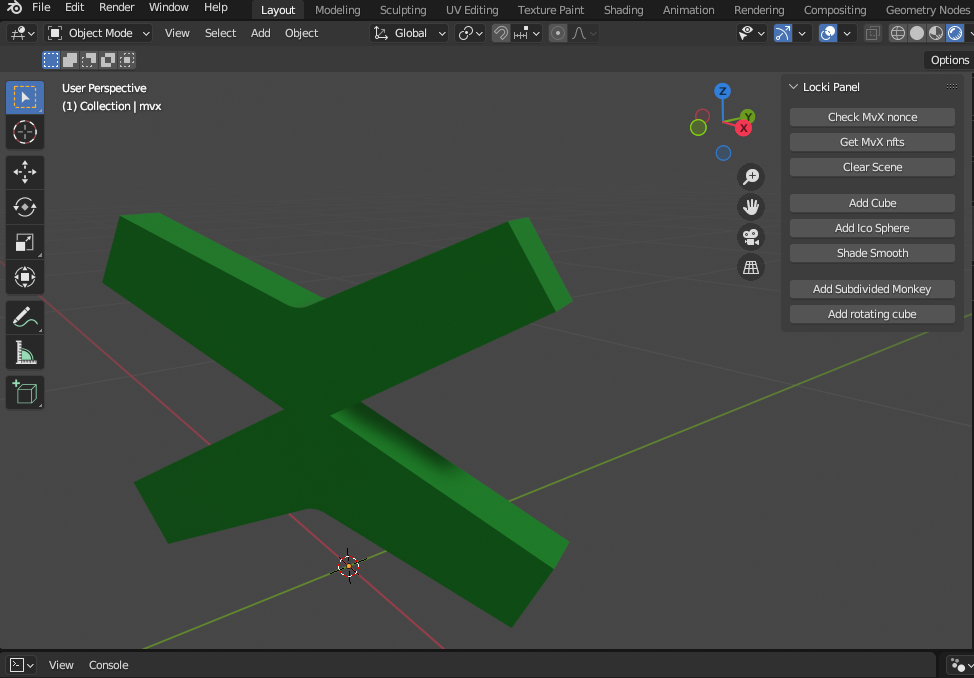

# MultiversX Blender Addon

Connect Blender to the MultiversX ecosystem, bridging the gap between 3D creation, generative design, and blockchain technology. 

## Introduction

The main goal of this addon is to seamlessly integrate Blender with the MultiversX ecosystem. This facilitates 3D artists, designers, and developers in the realization of 3D creation and generative design. Using this addon, users can manage the 3D data stored in their MultiversX devnet wallets and harness Blender's capabilities to construct, modify, and visualize 3D assets. From primitive CAD constructions to intricate meshes, and even the underlying Python code, everything is made accessible and manageable.

One of the prominent features is the integration with Blender's powerful Geometry Nodes, leveraging their capabilities to accelerate and enhance 3D creation processes.

## Requirements

- **Blender**: Ensure you're running a compatible version of Blender. [Download the latest version here](https://www.blender.org/download/).
- **MultiversX Devnet Wallet**: Before using this addon, you must possess a wallet on the MultiversX devnet.
- **API Key from app.locki.io**: Connect your MultiversX devnet wallet to [app.locki.io](https://app.locki.io) and obtain a connection API key. This key allows the addon to communicate and manage 3D data from your wallet.

## Installation

1. Download the latest release of the MultiversX Blender Addon.
2. Open Blender and navigate to `Edit > Preferences > Add-ons`.
3. Click on `Install` and select the downloaded addon file.
4. Activate the addon by ticking the checkbox.
5. In the addon preferences, enter your API key from app.locki.io.

## Usage

1. **Configuration**: After installing the addon, go to Blender preferences and locate the MultiversX addon settings. Here, enter your wallet address and the associated API key.
2. **Accessing the Panel**: In the main Blender UI, open the side panel (typically toggled with the `N` key). You should find the MultiversX panel available. From this panel, you can explore various creations and connect to the blockchain.
3. **Trying CAD Creations**: If you're keen on experimenting with CAD creation features, please send us a request on the Encode Discord channel. We'd be thrilled to facilitate a minting process for your designs.

## Status & Contribution

This project is currently in its **alpha** phase and is primarily a proof of concept for the MultiversX-Encode Hackathon. We're investing significant efforts to ensure its stability, extend its features, and enhance usability.

Feedback, bug reports, and contributions are highly appreciated. Feel free to open issues or submit pull requests.

## License

GNU GENERAL PUBLIC LICENSE Version 3, 29 June 2007